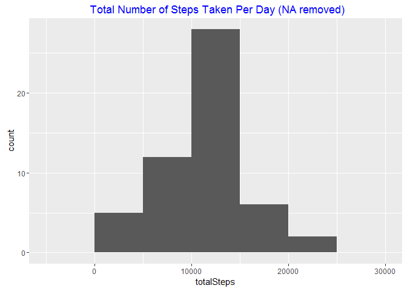
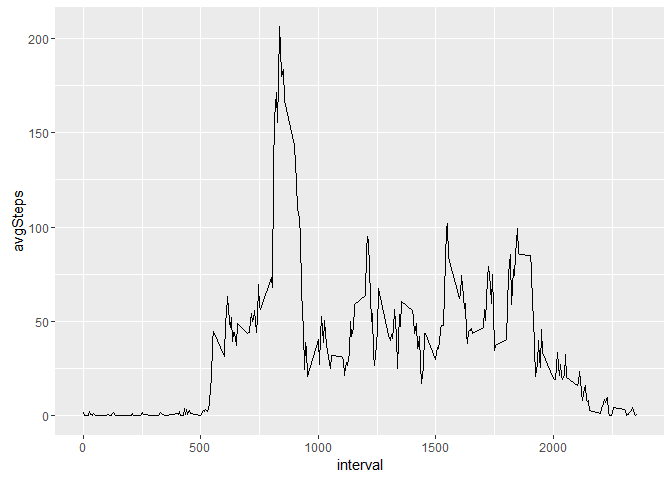
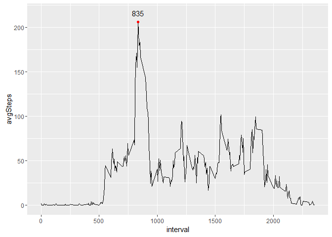
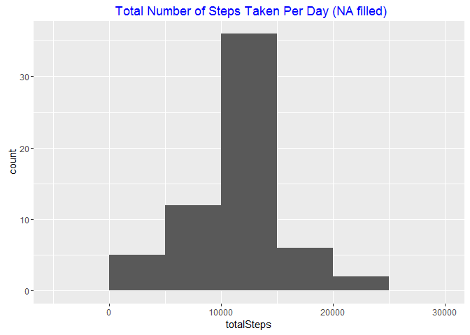
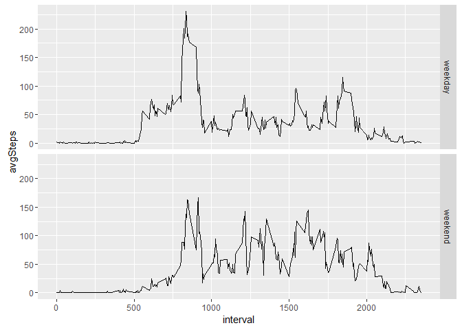

# Reproducible Research: Peer Assessment 1

## Loading and preprocessing the data

```r
data<-read.csv("activity.csv", stringsAsFactors = FALSE)
data$date<-as.Date(data$date)
```


## What is mean total number of steps taken per day?
1. Calculate the total number of steps taken per day

```r
  require(dplyr)
  
  by_day<-group_by(data, date)
  steps_by_day<-summarise(by_day,totalSteps=sum(steps,na.rm = TRUE))
  head(steps_by_day,n = 5)
```

```
## Source: local data frame [5 x 2]
## 
##         date totalSteps
##       (date)      (int)
## 1 2012-10-01          0
## 2 2012-10-02        126
## 3 2012-10-03      11352
## 4 2012-10-04      12116
## 5 2012-10-05      13294
```
2. Make a histogram of the total number of steps taken each day

```r
  require(ggplot2)
  
  p<-ggplot(data = steps_by_day,aes(x = date, y = totalSteps)) +
      geom_bar(stat = "identity")
  print(p)
```

\
3. Calculate and report the mean and median of the total number of steps taken per day

```r
  by_day<-group_by(data, date)
  steps_by_day<-summarise(by_day,meanSteps=mean(steps,na.rm = TRUE))
  head(steps_by_day,n = 5)
```

```
## Source: local data frame [5 x 2]
## 
##         date meanSteps
##       (date)     (dbl)
## 1 2012-10-01       NaN
## 2 2012-10-02   0.43750
## 3 2012-10-03  39.41667
## 4 2012-10-04  42.06944
## 5 2012-10-05  46.15972
```

```r
  steps_by_day<-summarise(by_day,medianSteps=median(steps,na.rm = TRUE))
  head(steps_by_day,n = 5)
```

```
## Source: local data frame [5 x 2]
## 
##         date medianSteps
##       (date)       (dbl)
## 1 2012-10-01          NA
## 2 2012-10-02           0
## 3 2012-10-03           0
## 4 2012-10-04           0
## 5 2012-10-05           0
```


## What is the average daily activity pattern?
1. Make a time series plot of the 5-minute interval (x-axis) and the average number of steps taken, averaged across all days (y-axis)

```r
  by_interval<-group_by(data, interval)
  steps_by_interval<-summarise(by_interval,avgSteps=mean(steps,na.rm = TRUE))
  p<-ggplot(data = steps_by_interval,aes(x = interval, y = avgSteps)) +
    geom_line()
  print(p)
```

\
2. Which 5-minute interval, on average across all the days in the dataset, contains the maximum number of steps?

```r
  maxAvgSteps<-max(steps_by_interval$avgSteps)
  p<-p+
    geom_point(data = filter(steps_by_interval, avgSteps==maxAvgSteps),colour="red")+
    geom_text(aes(label=interval),data = filter(steps_by_interval, avgSteps==maxAvgSteps),nudge_y = 10)
  print(p)
```

\

```r
  steps_by_interval<-arrange(steps_by_interval, desc(avgSteps))
  i<-1
  for(i in 1:nrow(steps_by_interval))
  {
    if(steps_by_interval$avgSteps[i+1]<steps_by_interval$avgSteps[i]){
      break
    }
  }
  maxInterval<-as.character(steps_by_interval$interval[1])
  if(i>1){
    for(j in 2:i){
      maxInterval<-paste(maxInterval, ",", steps_by_interval$interval[i])
    }
  }
```
Interval 835 contains the maximum number of steps.

## Imputing missing values
1. Calculate and report the total number of missing values in the dataset 

```r
  naRows<-nrow(data[is.na(data$steps),])
```
Dataset contain 2304 missing values.

2. Devise a strategy for filling in all of the missing values in the dataset 
**Use mean of each interval to fill NA**

3. Create a new dataset that is equal to the original dataset but with the missing data filled in.

```r
  ##Use mean of each interval to fill NA
  by_interval<-group_by(data,interval)
    steps_by_interval<-summarise(by_interval,avgSteps=mean(steps,na.rm = TRUE))
    na_interval<-distinct(data[is.na(data$steps),],interval)
    for (i in 1:nrow(na_interval)){
      data$steps[is.na(data$steps)&data$interval==na_interval$interval]<-steps_by_interval$avgSteps[steps_by_interval$interval==na_interval$interval]
    }
  naRows<-nrow(data[is.na(data$steps),])
  str(data)
```

```
## 'data.frame':	17568 obs. of  3 variables:
##  $ steps   : num  1.717 0.3396 0.1321 0.1509 0.0755 ...
##  $ date    : Date, format: "2012-10-01" "2012-10-01" ...
##  $ interval: int  0 5 10 15 20 25 30 35 40 45 ...
```
Dataset contain 0 missing values.

4. Make a histogram of the total number of steps taken each day

```r
  by_day<-group_by(data, date)
  steps_by_day<-summarise(by_day,totalSteps=sum(steps,na.rm = TRUE))
  p<-ggplot(data = steps_by_day,aes(x = date, y = totalSteps)) +
      geom_bar(stat = "identity")
  print(p)
```

\

```r
  steps_by_day<-summarise(by_day,meanSteps=mean(steps,na.rm = TRUE))
  head(steps_by_day,n = 5)
```

```
## Source: local data frame [5 x 2]
## 
##         date meanSteps
##       (date)     (dbl)
## 1 2012-10-01  37.38260
## 2 2012-10-02   0.43750
## 3 2012-10-03  39.41667
## 4 2012-10-04  42.06944
## 5 2012-10-05  46.15972
```

```r
  steps_by_day<-summarise(by_day,medianSteps=median(steps,na.rm = TRUE))
  head(steps_by_day,n = 5)
```

```
## Source: local data frame [5 x 2]
## 
##         date medianSteps
##       (date)       (dbl)
## 1 2012-10-01    34.11321
## 2 2012-10-02     0.00000
## 3 2012-10-03     0.00000
## 4 2012-10-04     0.00000
## 5 2012-10-05     0.00000
```
The values differ from the estimates from the first part of the assignment.

## Are there differences in activity patterns between weekdays and weekends?
1. Create a new factor variable in the dataset with two levels – “weekday” and “weekend”

```r
  getWeek<-function(date=as.Date()){
    w<-as.character()
    for (i in 1:length(date)){
      if(weekdays(date[i])=="星期六"|weekdays(date[i])=="星期日"){
        w<-c(w,"weekend")
      }
      else{
        w<-c(w,"weekday")
      }
    }
    w
  }
  data<-mutate(data, week=as.factor(getWeek(date)))
  head(data,5)
```

```
##       steps       date interval    week
## 1 1.7169811 2012-10-01        0 weekday
## 2 0.3396226 2012-10-01        5 weekday
## 3 0.1320755 2012-10-01       10 weekday
## 4 0.1509434 2012-10-01       15 weekday
## 5 0.0754717 2012-10-01       20 weekday
```
2.Make a panel plot containing a time series plot (i.e. type = "l") of the 5-minute interval (x-axis) and the average number of steps taken, averaged across all weekday days or weekend days (y-axis).

```r
  by_interval<-group_by(data, week, interval)
  steps_by_interval<-summarise(by_interval,avgSteps=mean(steps,na.rm = TRUE))
  
  p<-ggplot(data = steps_by_interval, aes(x = interval, y = avgSteps))+
    geom_line()+
    facet_grid(facets = week~.)
  print(p)
```

\
